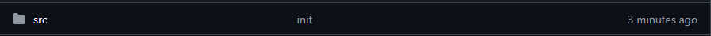

# 3rd Shock Army Website  

Welcome! 👋  

This is the repository for the **3rd Shock Army website**. From here, you can:  
- ✍️ Write **Guides**  
- 🛠️ Share **Tools**  
- 📰 Post **News/Articles** about Arma 3  

You **don’t need to be a programmer** to help. If you can write text or upload images, you can contribute!  

---

## 🔰 Contributing Content (Guides, Tools, News)

### Step 1: Fork the repository  
On the top-right of this page, click **Fork**.  
This makes your own copy of the website where you can add content.  


---

### Step 2: Find the right folder  
Inside your forked project, go to:  

```
/src/routes/
```

Here you’ll see folders:  
- `projects` → For **Projects** (addons, software, etc.)  
- `tools` → For **Tools** (scripts, utilities, etc.)  
- `guides` → For **Guides**  
- `news` → For **News/Articles**  



---

### Step 3: Add your file  
Each section has a folder starting with an underscore (`_guides`, `_tools`, etc.).  
Inside the correct folder, create a **new `.svx` file** (a text file with special formatting).  

Example for a project:  
```
/src/routes/projects/_projects/MyProject.svx
```

---

### Step 4: Add the file details  
Copy and paste this template into your new `.svx` file, then fill in your info.  

**For Projects:**  
```yaml
---
title: Project Title
creator: Your Name
type: Addon   # (Options: Addon, Utility Script, Software)
description: A short description
workshop_link: none
github_link: none
dedicated_page: none
layout: false
thumbnail: /your_image.png
---
```

**For Tools:**  
```yaml
---
title: Tool Name
creator: Your Name
type: Build Tool   # (Options: Build Tool, Addon, Utility, Script)
description: A short description
image: /_tools/myTool.png
link: https://example.com
layout: false
---
```

---

### Step 5: Add images (optional)  
Place images in the `/static/` folder.  

Allowed formats:  
```
.png, .jpg, .webp
```

Example for a tool:  
```
/static/_tools/myTool.png
```

---

## ⚙️ Contributing to Website Development  

If you want to work on the website code itself (not just content):  

```sh
git clone https://github.com/3SA-Research-Development-Unit/website.git
cd website
npm install
npm run dev
```
