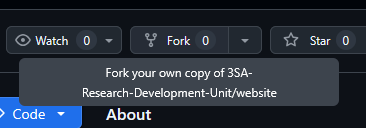

# Website

Welcome to the 3rd Shock Army web repository. From this repository you can contribute in adding **Guides, Tools, or writing up interesting Articles related to Arma 3**.

## I want to help with the site contents
If you wish to contribute your own guides, start by "forking" the repository



Then, access `/src/routes/`


Here you will find several folders called "Projects", "Tools", "Guides" and "News". To add your own content, simply create a new .svx file under the underscore folder inside.

For image additions, go to the bottom of this section.
### Adding a new "Project"
Example:
```
/src/routes/projects/_projects/MyProject.svx
```

Then inside the SVX file, paste the following meta:

```
---
title: Project Title
creator: Author
type: Addon
description: Your Description
workshop_link: none
github_link: none
dedicated_page: none
layout: false
thumbnail: /your_image.png
---
```
Note - Type has to be either; 'Addon', 'Utility Script' or 'Software'
Example - `type: Addon`


### Adding a new "Tool"
Example:
```
/src/routes/tools/_tools/MyTool.svx
```

Then inside the SVX file, paste the following meta:

```
---
title:
creator:
type:
description:
image:
link:
layout:
---
```
Note - Type has to be either; 'Build Tool', 'Addon', 'Utility' or 'Script'
Example - `type: Build Tool`

### Images
To add an image, navigate to /static/ and then according to what you're adding, include the image there. 

Allowed formats:
```
*.png
*.jpg
*.webp
```

Example:
```
/static/_tools/myTool.png
```
## I want to help with the site development.
```sh
git clone https://github.com/3SA-Research-Development-Unit/website.git # Clone Repository
cd website
npm install # Install Dependencies
npm run dev # Run Dev
```


